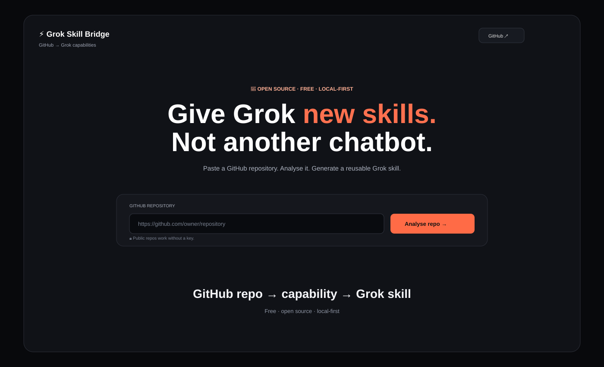

# ⚡ Grok Skill Bridge

### Turn great GitHub repositories into reusable Grok skills.

> **Paste a GitHub repo → understand the capability → bridge it to Grok.**

Grok Skill Bridge is a free, open-source, local-first toolkit for discovering useful capabilities inside GitHub repositories and packaging them as reusable **Grok Skills**.

It is designed for the situation where somebody has already built something brilliant — a Claude Skill, MCP server, browser automation toolkit, scraper, research workflow, developer tool, or agent utility — and you want to make that capability useful inside Grok without rebuilding it from scratch.

## ✨ What it does

- 🔗 Accepts a GitHub repository URL
- 🔎 Analyses repository metadata and structure
- 🧠 Identifies the capability a project provides
- 🧩 Detects agent-specific layers such as Claude instructions or MCP
- ⚡ Generates a Grok-compatible `SKILL.md`
- 📦 Downloads a portable skill artifact
- 🛡️ Keeps licence and security review in the workflow
- 🆓 Free and open source
- 🔒 Local-first: no Grok Skill Bridge account or backend required

## 🖥️ Screenshot



## 🚀 Try it

Open `public/index.html` directly in a browser, or run:

```bash
python3 -m http.server 4173 -d public
```

Then visit `http://localhost:4173`.

Click **✨ Try demo** to see the complete flow without connecting to GitHub.

## 🧠 How it works

```text
GitHub repository
       ↓
Repository analysis
       ↓
Capability detection
       ↓
Agent / MCP compatibility check
       ↓
Grok SKILL.md generation
       ↓
Review → install → test
```

Grok discovers skills from `.grok/skills/`, user-level skill directories and enabled plugins. Skills are reusable folders containing Markdown instructions, scripts and resources.

## 🔌 Why this exists

Grok is already compatible with Claude Code's skills, plugins, MCPs, agents and instruction files. The opportunity here is to make **capability discovery and adaptation** simple for ordinary users.

Instead of asking a user to understand agent frameworks, the long-term goal is:

> **"Find something useful on GitHub and make it usable by Grok."**

## 🗺️ Roadmap

- [x] Friendly web interface
- [x] Demo mode
- [x] GitHub public-repository metadata lookup
- [x] Grok `SKILL.md` generation
- [x] Local-first architecture
- [ ] Full repository tree analysis
- [ ] Claude Skill detector
- [ ] MCP detector and connector helper
- [ ] Automated compatibility scoring
- [ ] Sandbox validation
- [ ] One-click local Grok installation
- [ ] Optional public skill registry

## ⚠️ Security & licences

Do not execute code from an untrusted repository blindly. Review dependencies, credentials, scripts and external side effects first.

Grok Skill Bridge does **not** bypass GitHub authentication, repository access controls or software licences. Generated adapters should preserve attribution and comply with the original project's licence.

## 📜 Licence

MIT — see [LICENSE](LICENSE).
